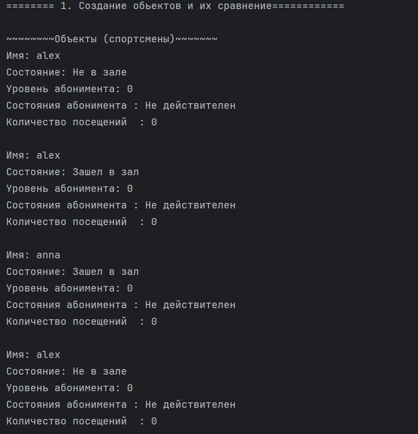
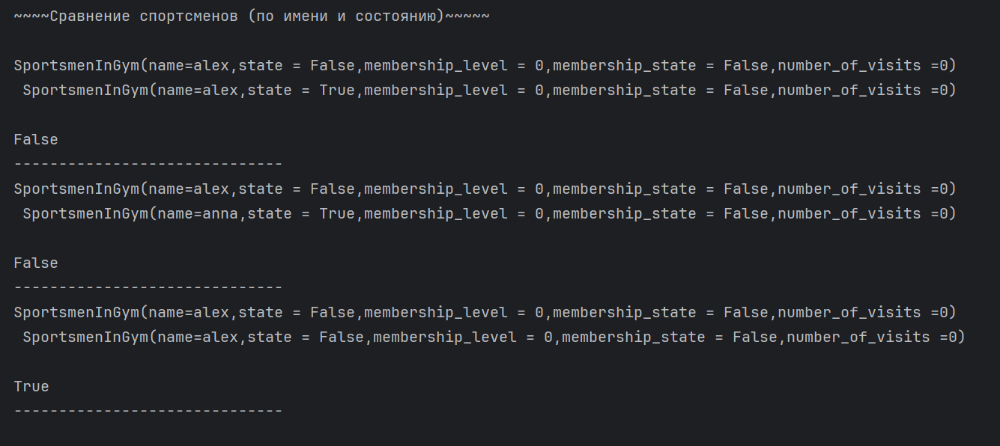
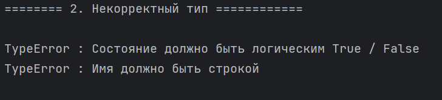
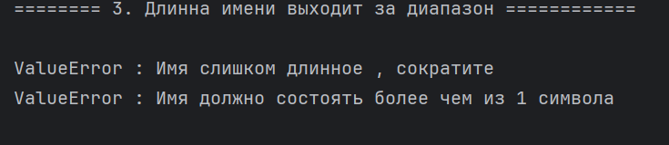
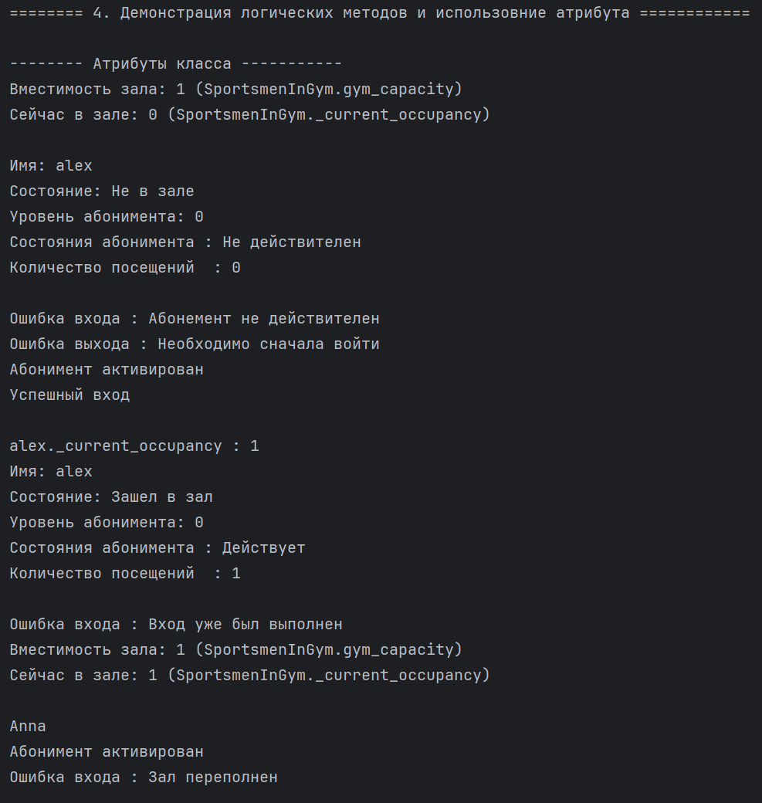
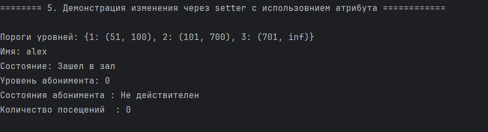
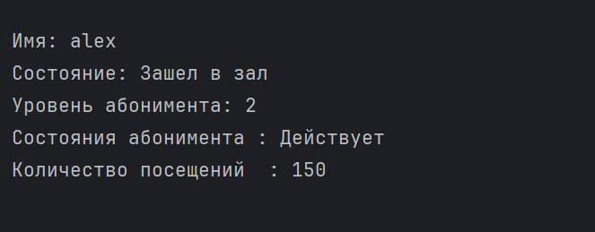

python_labs 
---------------------------------------
# Лабораторная работа 1
## **Тема Спорт**
### Введение:
* После долгих размышлений и перебирания вариантов , была найдена идея о контроле людей в спортзале, так как зал все же имеет ограниченное пространство. Так же зачастую присутствует система абониментов было бы интересно добавить некую программу лояльности , которая так же будет являться системой поощерений в формате : чем больше ходишь - тем больше скидка . Система считает количество посещений и в зависимости от этого выдает опредленный уровень абонимента от кототрого будет зависеть стоимость.
### Демострация работы (demo.py)
* 1 сценарий 

Происходит создание 4 объектов и сравнения 1го с остальными (по имени и состоянию)
* 2 сценарий 

Проверяем (с помощью try except) случай сначала с неверным типом состояния, затем с не верным типом имени
* 3 сценарий 

Проверяем имя на длинну (с помощью try except) от 2 до 20 символов
* 4 сценарий 

  * **Атрибутами класса**  являются gym_capacity и current_occupancy 
  - Присутсвуют **логические методы**:
  - exit :                совершен выход (можно совершить только после того как был вход)
  - enter:                совершен вход (можно совершить только при наличии абонимента и если вход не юыл выполнен ранее и если есть места в зале)
  - membership_activate:  активация абонемента (можно совершить только если абонимент не был активирован)
  - membership_deactivate:деактивация абонемента (можно совершить только при действительном абонименте и находясь вне зала)
  - при совершении входа или выхода счетчик людей в зале меняется (счетчик является атрибутом класса)
* 5 сценарий
  * 
  * совершается 150 посещений (150 входов после активации )

  * При достижении определенного количества посещений меняется уровень абонимента согласно порогам (порги заданы как атрибут класса)