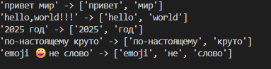

# python_labs 
## Лабораторная работа 1 
### Задание 1 
```python
name = input('Имя:')
age = int(input('Возраст: '))
print(f'Привет {name}! Через год тебе будет  {age + 1 }') 
```

### Задание 2
```python
num1 = float(input('a: ').replace(',','.'))
num2 = float(input('b: ').replace(',','.'))
sum = num1 + num2
avg = round (sum / 2 , 2) 
print('sum =' ,sum,'avg =', avg)
```

### Задание 3
```python
price = float(input('Цена (₽): '))
discount = float(input('Скидка (%): '))
vat = float(input('НДС (%): '))
base = (price * (1 - discount/100))
vat_amount = (base * (vat/100) )
total = (base + vat_amount) 
print(f'База после скидки:{base:.2f}')
print(f'НДС:{vat_amount:.2f}')
print(f'Итого к оплате:{total:.2f}')
```

### Задание 4
```python
minuts = int(input(''))
hours = minuts // 60 
min_ost = minuts % 60 
print(f'{hours}:{min_ost:02d}') 
```

### Задание 5
```python
all_name = input('ФИО:')
all_name = ' '.join(all_name.split())
inic = ''
for el in all_name :
    if el.isupper():
        inic += el
print(f'Инициалы: {inic}')
print(f'Длинна (строки): {len(all_name)}')
```

### Задание 6 
```python
kol_st = int(input())
och_uch = 0
zaoch_uch = 0
while kol_st != 0:
    uch = input()
    if 'True' in uch:
        och_uch += 1
    elif 'False' in uch:
        zaoch_uch += 1
    kol_st -= 1
print (och_uch,zaoch_uch)
```

### Задание 7
```python
stroka = input()
stroka = stroka.split('.')[0]
itog_str = ''
frst_sim = 0
frst_num = 0
indx_first = 0
indx_secd = 0
for el in stroka :
    if el.isupper() and frst_sim == 0:
        frst_sim = 1
        itog_str += el 
        indx_first = stroka.index(el)
    if el.isdigit() and frst_num == 0 and frst_sim != 0:
        indx_secd = stroka.index(el) + 1
        itog_str += stroka[indx_secd]
        frst_num = 1
step = int(indx_secd) - int(indx_first)
for i in range(indx_secd + step,len(stroka),step ):
    itog_str += stroka[i]
print(itog_str)
```


## Лабораторная работа 2
### Задание 1 
#### min_max 
```python
nums = [[3, -1, 5, 5, 0],[42],[-5, -2, -9],[],[1.5, 2, 2.0, -3.1]]
def min_max(nums):
    if list:
        return (min(nums),max(nums))
    else:
        return ('ValueError')
for i in nums:
    print(f"{i} -> {min_max(i)}")
```

#### unique_sorted
```python
nums = [[3, 1, 2, 1, 3],[],[-1, -1, 0, 2, 2],[1.0, 1, 2.5, 2.5, 0]]
def unique_sorted(nums):
    return sorted(list(set(nums)))
for i in nums:
    print(f'{i} -> {unique_sorted(i)}')
```

#### flatten
```python
nums = [[[1, 2], [3, 4]],([1, 2], (3, 4, 5)),[[1], [], [2, 3]],[[1, 2], "ab"]]
def flatten(mat):
    st_itog = []
    for i  in list:
        if type(i) != str:
            for s in i :
                st_itog.append(s)
        else:
            return 'TypeError'
    return st_itog
for i in nums:
     print(f'{i} -> {flatten(i)}')
```

### Задание 2
#### transpose
```python
listik =[[[1, 2, 3]],[[1], [2], [3]] , [[1, 2], [3, 4]],[[1, 2], [3]]]
def transpose(mat: list[list[float | int]]) -> list[list] :
    pere_list = []
    for i in range(len(mat[0])) :
        if len(mat) == 1 or len(mat[0]) == len(mat[1]) :
            stroka = []
            for j in range(len(mat)) :
                stroka.append(mat[j][i])
            pere_list.append(stroka)
        else:
            return 'ValueError'
    return pere_list
for i in listik:
    print(f"{i} -> {transpose(i)}")
```

#### row_sums
```python
listik = [[[1, 2, 3], [4, 5, 6]],[[-1, 1], [10, -10]],[[0, 0], [0, 0]],[[1, 2], [3]]]
def row_sums(mat: list[list[float | int]]) -> list[float] :
    check = 1
    for i in range(1,len(mat)):
        if len(mat[i-1]) != len(mat[i]):
            check = 0
    if check:
        sums = [sum(x) for x in mat]
    else:
        return 'ValueError'
    return sums
for i in listik:
   print(f"{i} -> {row_sums(i)}")
```

#### col_sums
```python
listik =[ [[1, 2, 3], [4, 5, 6]],[[-1, 1], [10, -10]],[[0, 0], [0, 0]],[[1, 2], [3]]] 
def col_sums(mat: list[list[float | int]]) -> list[float]:
    check = 1
    for i in range(1,len(mat)):
        if len(mat[i-1]) != len(mat[i]):
            check = 0
    if check:
        summ = [0 for i in range(len(mat[0]))]
        for i in range(len(mat[0])):
            for j in range(len(mat)):
                summ[i] += mat[j][i]
        return summ 
    else:
        return 'ValueError'
for i in listik:
   print(f"{i} -> {col_sums(i)}")
```

### Задание 3
```python
input = [("Иванов Иван Иванович", "BIVT-25", 4.6),("Петров Пётр", "IKBO-12", 5.0),("Петров Пётр Петрович", "IKBO-12", 5.0),("  сидорова  анна   сергеевна ", "ABB-01", 3.999)]

def cut_name (fio:str):
    name = (' '.join(fio.split())).split(' ')
    scr_name = name[0] + ' '
    for i in range(1,len(name)):
        scr_name += name[i][0].upper() + '.'
    return scr_name

def format_record(rec: tuple[str, str, float]) -> str:
    if  (type(rec[0]) == str and type(rec[1]) == str and  type(rec[2]) == float  ) and (rec[0].strip() and rec[1].strip()):
        itog =f'{cut_name(rec[0])}, гр. {rec[1]}, {rec[2]:.2f}'
        return itog
    elif type(rec[0]) != str or type(rec[1]) != str or  type(rec[2]) != float: 
        return 'TypeError' 
    elif not rec[0].strip() or not rec[1].strip():
        return 'ValueError'
'''
TypeError - если не тот тип 
ValueError - если пустое ФИО или группа 
'''
for i in input:
   print(f"{i} -> {format_record(i)}")

```


## Лабораторная работа 3
### Задание A 
#### normalize
```python
def normalize(text: str, *, casefold: bool = True, yo2e: bool = True) -> str:
    text = ' '.join(text.split())
    for el in text:
        if el.isupper():
            casefold = True 
            break
        else:
            casefold = False
    if casefold:
        text = text.casefold()
    if 'ё' not in text:
        yo2e = False
    if yo2e:
        text = text.replace('ё','е')
    return text 
```

#### tokenize
```python
def tokenize(text: str) -> list[str]:
    return re.findall(r'[а-я0-9-_]+',text)
```

#### count_freq
```python
alf = list(sorted(set(tokens)))
    chastots = {}
    for el in alf:
        chastots[el] = tokens.count(el)
    return chastots
```
#### top_n
```python
def top_n(freq: dict[str, int], n: int = 5) -> list[tuple[str, int]]:
    top_dict =dict(sorted(freq.items(), key=lambda item: (-item[1], item[0])))
    top = list(top_dict.items())[:n]
    return top
```


### Задание B
```python
from lib.text import normalize as norm 
from lib.text import tokenize as t 
from lib.text import count_freq as c
from lib.text import top_n 
text = "Привет, мир! Привет!!!"
good_text = t(norm(text))
kol_slov = len(good_text)
kol_unik_slov = len(set(good_text)) 
top = top_n(c(good_text))
print(f'Всего слов: {kol_slov}')
print(f'Уникальных слов: {kol_unik_slov}')
print('Топ-5:')
for el in top:
    print(f'{el[0]} : {el[1]}')
```

## Лабораторная работа 4
### Задание 1
```python
import csv
from pathlib import Path
from typing import Iterable, Sequence


def read_text(path: str | Path, encoding: str = "utf-8") -> str:
    p = Path(path)
    return p.read_text(encoding=encoding)


def write_csv(rows: Iterable[Sequence],path: str | Path,header: tuple[str, ...] | None = None,encoding: str = "utf-8") -> None:
    p = Path(path)
    rows_list = list(rows)
    if rows_list:
        expected_length = len(rows_list[0])
        for i, row in enumerate(rows_list):
            if len(row) != expected_length:
                raise ValueError(
                    f"Строка {i} имеет длину {len(row)}, "
                    f"ожидалась длина {expected_length}"
                )

    if header and rows_list:
        if len(header) != len(rows_list[0]):
            raise ValueError(
                f"Длина заголовка ({len(header)}) не совпадает "
                f"с длиной строк данных ({len(rows_list[0])})"
            )

    
    with p.open("w", newline="", encoding=encoding) as f:
        writer = csv.writer(f)

        if header is not None:
            writer.writerow(header)

        for row in rows_list:
            writer.writerow(row)


def ensure_parent_dir(path: str | Path) -> None:
    p = Path(path)
    parent = p.parent

    if str(parent) and str(parent) != ".":
        parent.mkdir(parents=True, exist_ok=True)
```
Кодировку можно поменять при использовании read_text, используя второй параметр
```python
from pathlib import Path
from src.lab04.io_txt_csv import read_text,  write_csv


PROJECT_ROOT = Path(__file__).resolve().parent.parent.parent
data_dir = PROJECT_ROOT / "data" / "lab04"
print(data_dir)

text = read_text(data_dir / "input.txt") # возвращает строку
write_csv([("word","count"),("test",3)], data_dir/"check.csv")  # создаст CSV
print(text)

```
  

### Задание 2
```python
from pathlib import Path
from src.lab04.io_txt_csv import read_text,  write_csv
from src.lib.text import normalize,tokenize,count_freq,top_n

PROJECT_ROOT = Path(__file__).resolve().parent.parent.parent
data_dir = PROJECT_ROOT /"data" / "lab04"
count_file = int(input("Введите количество входящих файлов (число):"))

def chek_text(input_file,coding):
    try:
        if coding != "":
           return tokenize(normalize(read_text(input_file, encoding=coding)))
        else:
            return tokenize(normalize(read_text(input_file)))
    except FileNotFoundError:
        return (f"Файл '{input_file}' не найден!")

    except UnicodeDecodeError:
        return (f"Невозможно прочитать с кодировкой {coding}")

    if not text.strip():
        return (("  Входной файл пустой"),
        write_csv([], output_file, header=("word", "count")),
                ("\nВсего слов: 0\n",
                 "Уникальных слов: 0"))

def do_report(input_file, output_file, coding):
    text = chek_text(input_file, coding)
    count_word = len(text)
    text = count_freq(text)
    count_uni_word = 0
    for i in text.items():
        if i[1] == 1:
            count_uni_word += 1
    text_for_report = [("word", "count")] + top_n(text)
    # print(text_for_report)
    write_csv(text_for_report, data_dir / output_file)
    print(f"Всего слов :      {count_word}")
    print(f"Уникальных слов : {count_uni_word}")
    for (word, count) in text_for_report:
        print(f"{word:<12} {count:>5}")

def do_report_all(text, input_files):
    print(f"{'file'} {'word':<12} {'count':<5}")
    for i in range(0,len(text)):
        text_all = top_n(count_freq(text[i]))
        file = input_files[i]
        for (word, count) in text_all:
            print(f"{file} {word:<12} {count:<5}")

all_text = []
text_for_all = []
codings = []
input_files = []
if count_file > 1:
    for i in range(count_file):
        input_name = input("Введи полное название входящего файла(по умолчанию input.txt) :")
        if not input_name:
            input_name = "input.txt"
        input_files.append(input_name)
        coding = input("Введите кодировку если она не utf-8 (по умолчанию :utf-8):")
        if not coding:
            coding = ""
        codings.append(coding)
        input_file = data_dir / input_name  
        all_text += chek_text(input_file, coding)
        text_for_all.append(chek_text(input_file, coding))
    output_name = input("Введи полное название сходящего файла(по умолчанию :report.csv) :")
    if not output_name:
        output_name = "report.csv"
    all_text = ' '.join(all_text)
    rezum_file =  data_dir / "dadada.txt"
    with open(rezum_file, "w", encoding="utf-8") as file:
        file.write(all_text)
    print('='*50)
    do_report_all(text_for_all, input_files)
    print('~'*50)
    do_report(rezum_file, output_name, coding="utf-8")


elif count_file == 1:
    input_name = input("Введи полное название входящего файла(по умолчанию input.txt) :")
    if not input_name:
        input_name = "input.txt"
    output_name = input("Введи полное название сходящего файла(по умолчанию :report.csv) :")
    if not output_name:
        output_name = "report.csv"
    coding = input("Введите кодировку если она не utf-8 (по умолчанию :utf-8):")
    if not coding:
        coding = ""
    input_file = data_dir /input_name #
    output_file = data_dir /output_name#
    do_report(input_file, output_file, coding)
```
Проверка обычного файла 

 

Проверка пустого файла

 

Проверка файла с кодировкой cp1251

 
#### *************

## Лабораторная работа 5
Для запуска нужно из корня проекта (находясь в python_labs )  написать :

1.
Желательно что б было виртуальное окружение
``` 
pip install  .
```
если нет 
```
pip install -r requirements.txt
```
2. Запустить файл одной из этих команд 
```
main      # не сработает без pip install  .
python -m lab05.main
python src/lab05/main.py
```
#### После запуска попадаем в меню 

#### Примеры работы и результат 
#### JSON -> CVS


#### CVS -> JSON


#### 1 вариант ошибки при JSON -> CVS или CVS -> JSON

#### 2 вариант ошибки при JSON -> CVS или CVS -> JSON

#### CSV -> XLSX


#### 1 вариант ошибки при CSV -> XLSX


#### 2 вариант ошибки при CSV -> XLSX

## Лабораторная работа 5
1. Желательно чтоб было виртуальное окружение
``` 
pip install  .
```
если нет 
```
pip install -r requirements.txt
```
2. Команды запуска (из корня проекта)
``` 
python -m src.lab06.cli_text cat --input (полный путь к файлу)
python -m src.lab06.cli_text cat --input (полный путь к файлу) --n (для вывода с нумерацией)

python -m src.lab06.cli_text stats --input (полный путь к файлу)
python -m src.lab06.cli_text stats --input (полный путь к файлу) --top 3 (для указание количества позиций в топе)

python -m src.lab06.cli_convert json2csv --in (название входящего файла) --out (название исходящего файла)
python -m src.lab06.cli_convert csv2json --in (название входящего файла) --out (название исходящего файла)
python -m src.lab06.cli_convert csv2xlsx --in (название входящего файла) --out (название исходящего файла)
```
### Примеры работы


## Лабораторная работа 7
Для запуска
1.
Желательно что б было виртуальное окружение
``` 
pip install  .
```
### Задание A
```
pytest tests/test_text.py 
```

### Задание B
```
pytest tests/json_csv.py
```

### Задание C

### Задание ★

## Лабораторная работа 8 
### Класс Students 
| Поле       | Тип   | Описание |
|------------|-------| ----------- |
| fio        | str   | Фамилия и инициалы студента (формат: Фамилия И.О.) |
| birthdate  | str   | Дата рождения в формате YYYY/MM/DD  |
| group      | str   | Название учебной группы |
| gpa        | float | Средний балл (от 0.0 до 5.0)  |
### models.py
#### __post_init__
Проверки:
1. Дата рождения (birthdate):
    - Должна соответствовать формату %Y/%m/%d (например, 2000/01/20).
    - Не может быть пустой строкой.
    - Защита от "гостей из будущего": Дата рождения не может быть больше текущей даты (сравниваются год, месяц и день).

2. Средний балл (gpa):
   - Должен быть типом float.
   - Должен находиться в диапазоне от 0.0 до 5.0 включительно.

3. ФИО (fio):
   - Не может быть пустым.
   - Проверяется регулярным выражением: ^[а-яА-ЯёЁa-zA-Z-]+ [а-яА-ЯёЁa-zA-Z]\.[а-яА-ЯёЁa-zA-Z]\.$.
   - Требуемый формат: Фамилия И.О. (обязательно наличие пробела после фамилии и точек после инициалов). Допускаются двойные фамилии через дефис.

4. Группа (group):
   - Не может быть пустой строкой или состоять только из пробелов.
#### Методы класса
1. age 
    - Сравнивает текущую дату с датой рождения. Если день рождения в текущем году еще не наступил, вычитает 1 год из разницы лет.
2. to_dict 
   - Сериализует объект студента в словарь
3. from_dict
   - Классовый метод (Class Method) Создает экземпляр класса Student из словаря.
4. __str__ 
   - Возвращает строковое представление объекта в формате: Student (Фамилия И.О., YYYY/MM/DD, Группа, GPA)
#### Примеры запуска

#### Примеры ошибок 

### serialize.py
#### students_to_json(students, path)
- Принимает список объектов Student, конвертирует их в словари и записывает в JSON-файл.
#### students_from_json(path) 
- Читает JSON-файл, валидирует структуру и возвращает список объектов Student. 
#### Примеры запуска
[Входящий файл](./data/lab08/students_input.json)
```json
[
  {
    "fio": "Твёрдый-Ёжиков А.А.",
    "birthdate": "2003/11/15",
    "group": "ЛЕС-33",
    "gpa": 4.1
  },
  {
    "fio": "Smith J.D.",
    "birthdate": "1999/03/31",
    "group": "ENG-01",
    "gpa": 5.0
  },
  {
    "fio": "Лодырев В.В.",
    "birthdate": "2004/02/29",
    "group": "СПОРТ-10",
    "gpa": 0.0
  },
  {
    "fio": "Простой П.П.",
    "birthdate": "2000/12/20",
    "group": "ИУ5-34Б (маг)",
    "gpa": 3.95
  }
]
``` 

```python 
students = [
        Student("Иванов И.И.", "2000/01/15", "ИВТ-101", 4.5),

        Student("Smith J.W.", "1999/11/20", "ENG-22", 3.8),

        Student("Сидорова А.А.", "2001/05/05", "МАТ-10", 5.0),

        Student("Петров П.П.", "2002/09/01", "ФИЗ-33", 0.0),
    ]
``` 
[Исходящий файл](./data/lab08/students_output.json)
```json
[
  {
    "fio": "Иванов И.И.",
    "birthdate": "2000/01/15",
    "group": "ИВТ-101",
    "gpa": 4.5
  },
  {
    "fio": "Smith J.W.",
    "birthdate": "1999/11/20",
    "group": "ENG-22",
    "gpa": 3.8
  },
  {
    "fio": "Сидорова А.А.",
    "birthdate": "2001/05/05",
    "group": "МАТ-10",
    "gpa": 5.0
  },
  {
    "fio": "Петров П.П.",
    "birthdate": "2002/09/01",
    "group": "ФИЗ-33",
    "gpa": 0.0
  }
]
```


