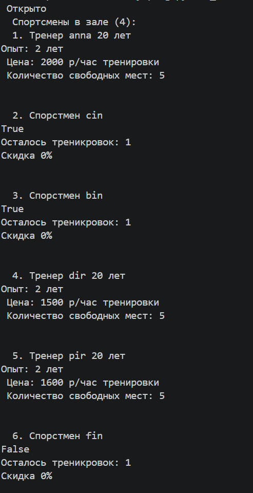
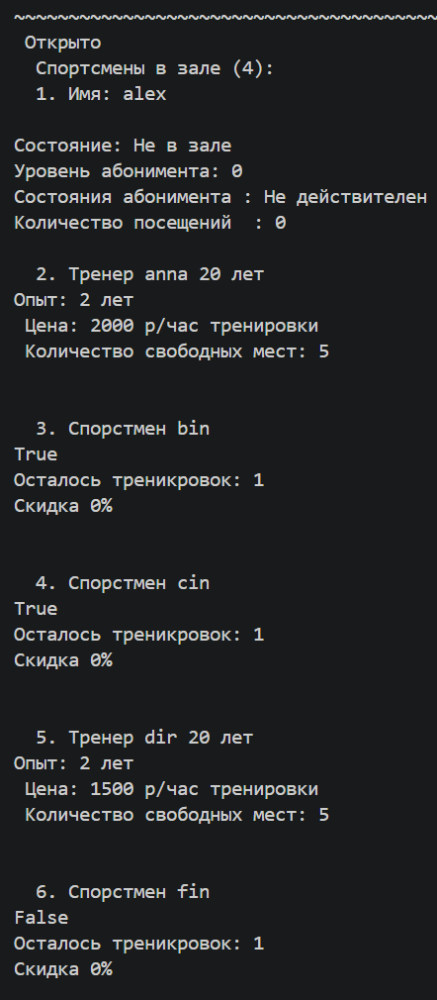
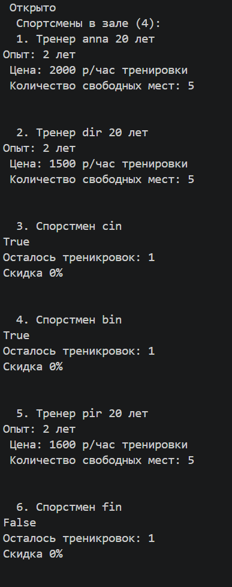
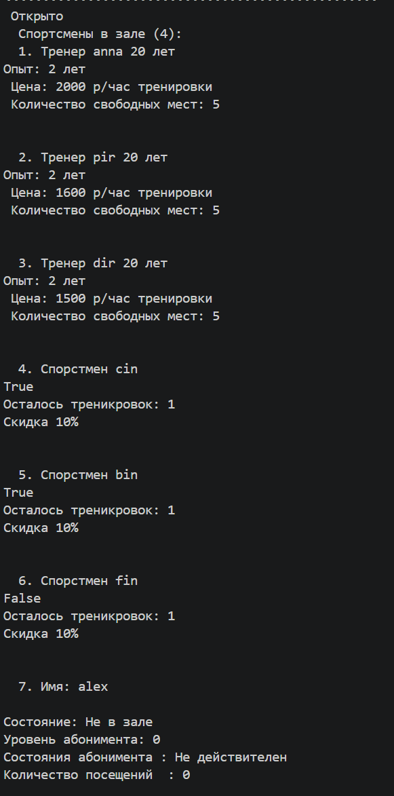
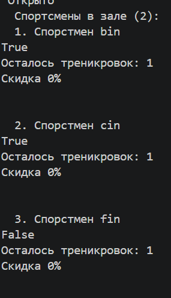
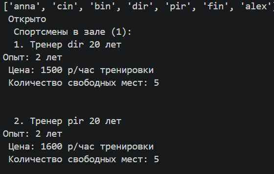

# Лабораторная работа №5 
## Цель работы
* Освоить передачу функций как аргументов в другие функции и методы.
* Научиться применять встроенные функции высшего порядка: `map`, `filter`, `sorted`.
* Понять концепцию паттерна «Стратегия» и реализовать его на Python.
* Освоить `lambda`-выражения и их практическое применение.
* Интегрировать функциональный стиль с объектно-ориентированным кодом из предыдущих
### Демонстрация 
* создание коллекции объектов 

* сортировка одной коллекции тремя разными стратегиями — вывод каждый раз
1. Сортировка по имени 
 
2. По типу (сначала тренер , потом спортсмены)

3. По цене 

* фильтрация коллекции двумя разными функциями-фильтрами
1. По тренерам 

2. по спомтрсменам 

######
