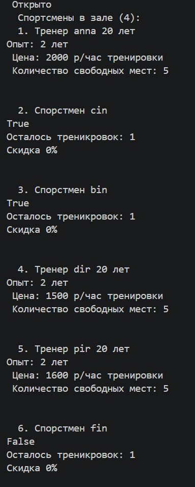
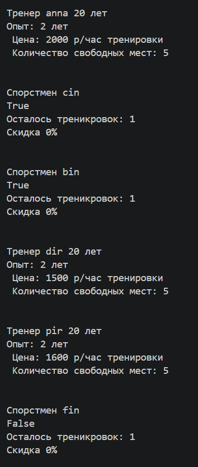
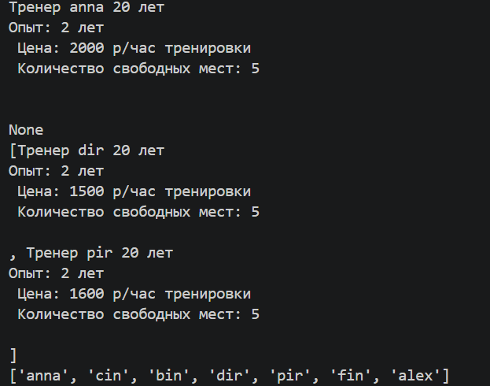

# Лабораторная работа №6: Обобщенное программирование и статическая типизация в Python
## Цель работы
* Освоить систему аннотаций типов в Python (typing).
* Научиться создавать обобщённые (generic) классы с помощью TypeVar и Generic.
* Понять концепцию структурной типизации через typing.Protocol.
#### Переменные типа (TypeVar)

### В файле container.py были объявлены следующие переменные типов:

* T — универсальный параметр типа общего назначения для элементов, хранящихся в коллекции.

* R (Result/Return) — временный тип-хамелеон общего назначения. Используется исключительно в методе map(), чтобы динамически фиксировать и возвращать новый тип данных после трансформации элементов коллекции.

* P — переменная типа, ограниченная протоколом Priced (bound=Priced).

* A — переменная типа, ограниченная протоколом Activatable (bound=Activatable).
Обобщенный класс (Generic-контейнер)

### Реализован параметризованный класс TypedCollection(Generic[T]). Он выступает универсальным контейнером-оберткой над списком элементов. Использование Generic[T] гарантирует, что на этапе статического анализа среда разработки (IDE) точно знает внутренний тип объектов коллекции и предоставляет полную автоподстановку (IntelliSense) методов.

### В класс были добавлены новые обобщенные методы:

* find(predicate: Callable[[T], bool]) -> Optional[T] — возвращает первый найденный по условию объект или None.

* filter(predicate: Callable[[T], bool]) -> list[T] — возвращает отфильтрованный стандартный список элементов.

* map(transform: Callable[[T], R]) -> list[R] — трансформирует элементы коллекции, изменяя тип возвращаемого списка с T на R.

#### Демонстрация 
#### создание типизированной коллекции и добавление объектов, демонстрация валидации типов при добавлении объекта, получение всех элементов и вывод каждого

#### вызов find() — один раз элемент найден, один раз не найден (результат None), вызов filter() — показать отфильтрованный список, вызов map() — два раза с разными функциями, чтобы было видно что тип результата меняется + работа map по имени 

Структурные интерфейсы (Protocol)

Для реализации утиной типизации на уровне статического анализа без использования классического наследования были объявлены два протокола:

    Priced(Protocol) Описывает структуру объектов, имеющих незащищенный атрибут стоимости:
    Python

    class Priced(Protocol):
        price: int  # Открытое поле стоимости

    Соответствующие классы: Trainer (содержит инициализацию цены в конструкторе). Класс EduSportsmen протоколу не соответствует, так как у него отсутствует поле price.

    Activatable(Protocol) Описывает структуру объектов, имеющих незащищенный булев атрибут состояния:
    Python

    class Activatable(Protocol):
        state: bool  # Открытое поле статуса присутствия (в зале / отсутствует)

    Соответствующие классы: Оба основных класса бизнес-логики (Trainer и EduSportsmen) успешно соответствуют данному протоколу «по факту» наличия атрибута state, не наследуя его явно.