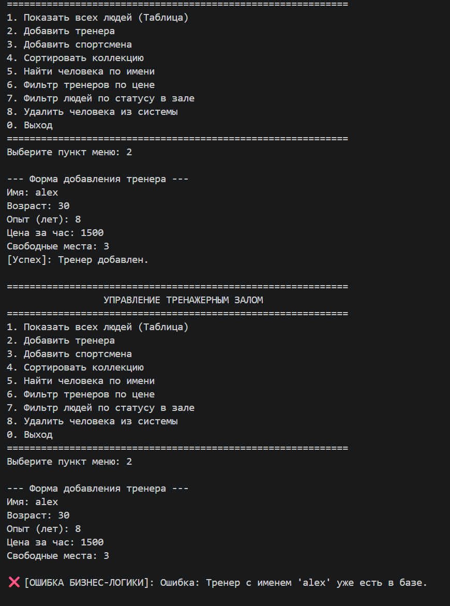
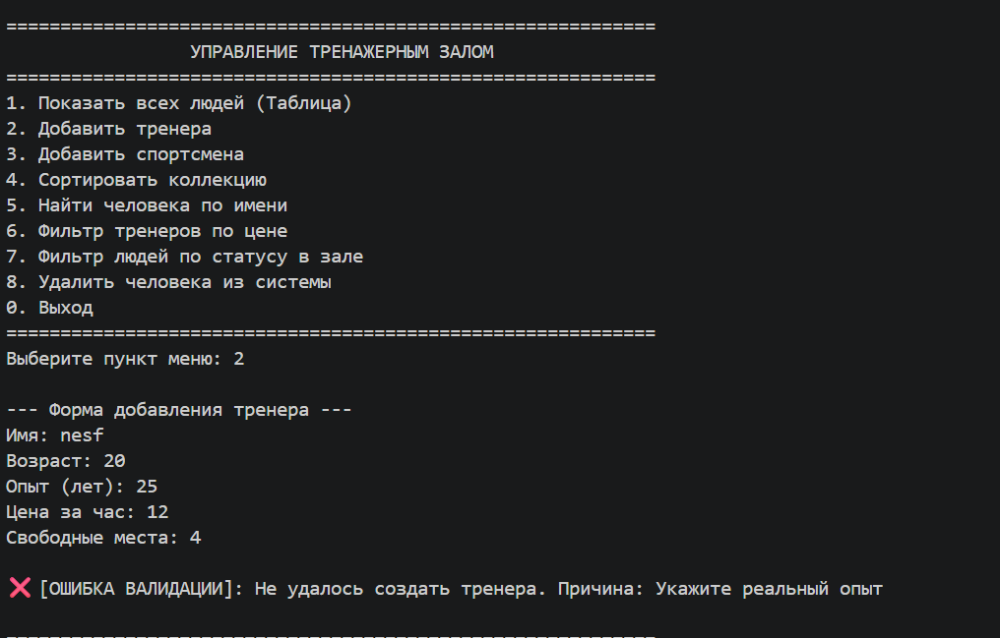
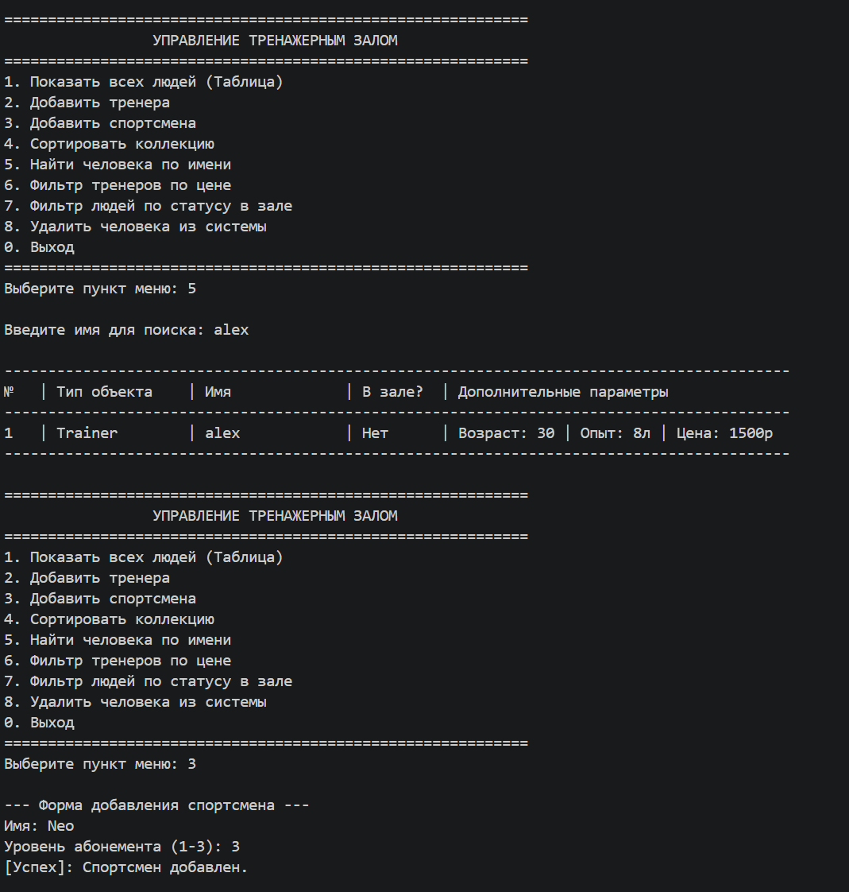
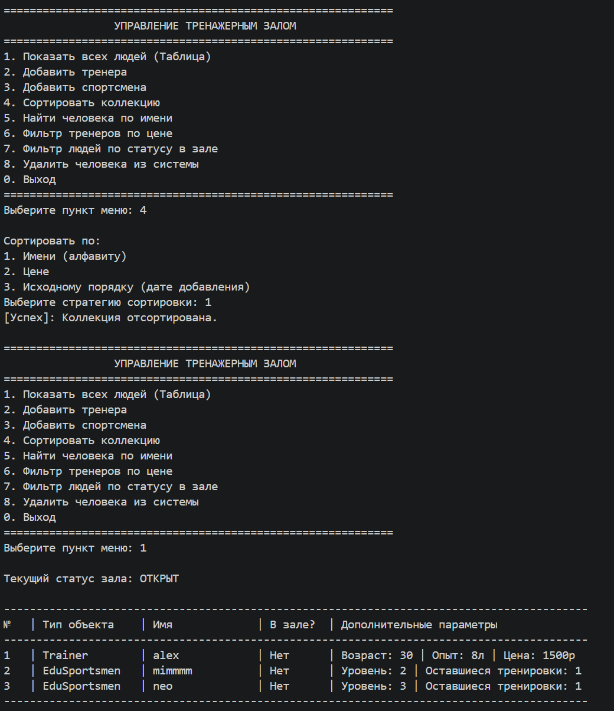
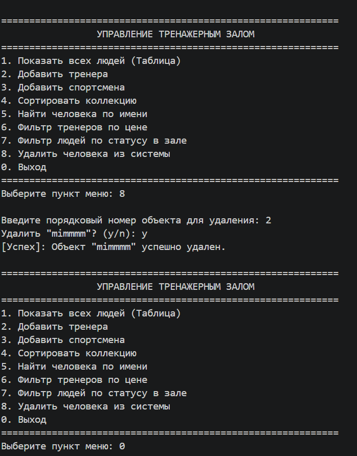

# ЛР-7 — Консольное приложение
## Цель работы
* Объединить все знания, полученные в ЛР1–ЛР6, в единое работающее приложение.
* Реализовать интерактивный **CLI-интерфейс** с меню и вводом пользователя.
**Примененные навыки:**
* Разделение кода на слои: интерфейс (CLI), бизнес-логика (App) и работа с файлами (Storage).
* Обработка пользовательских ошибок и исключений.
* Сохранение состояния программы в формат JSON.

---

## 2. Структура проекта
* **`main.py`** — Главный файл для запуска программы. Содержит основной цикл меню и перехватывает все ошибки.
* **`app.py`** — Слой бизнес-логики. Управляет коллекцией объектов, добавляет, фильтрует и удаляет элементы .
* **`cli.py`** — Интерфейс пользователя. Отвечает за вывод меню, красивых таблиц и ввод данных пользователем.
* **`storage.py`** — Отвечает за запись коллекции в JSON-файл и чтение из него.
* **`models.py`** — Хранит кастомные классы ошибок приложений (`ItemNotFoundError`, `DuplicateItemError`, `InvalidDataError`).
## 3. Описание CLI

### Реализованные пункты меню:
1. **Показать всех людей (Таблица)** — Вывод текущего статуса зала (открыт/закрыт) и таблицы со всеми тренерами и спортсменами.
2. **Добавить тренера** — Пошаговый ввод данных нового тренера.
3. **Добавить спортсмена** — Пошаговый ввод данных нового спортсмена.
4. **Сортировать коллекцию** — Сортировка по имени, по цене или сброс к исходному порядку.
5. **Найти человека по имени** — Поиск и вывод человека по его имени.
6. **Фильтр тренеров по цене** — Вывод тренеров в указанном диапазоне цен.
7. **Фильтр людей по статусу в зале** — Показывает отдельно тех, кто сейчас в зале, и тех, кто ушел.
8. **Удалить человека из системы** — Удаление по номеру строки. Перед удалением запрашивает подтверждение `(y/n)`.
0. **Выход** — Закрытие программы с сохранением данных.

### Обработка ошибок ввода:
Программа защищена от случайных сбоев и некорректных действий пользователя:
* **Ввод текста вместо числа:** Функция `safe_input_int()` перехватывает ошибку `ValueError`. Если вместо числа ввести буквы, программа не упадет, а попросит повторить ввод.
* **Повторяющиеся имена:** Если добавить человека с уже существующим именем, сработает `DuplicateItemError`, и интерфейс выведет понятное предупреждение.
* **Неверные индексы или пустые поиски:** При попытке удалить несуществующий номер строки или найти человека, которого нет в базе, перехватывается `ItemNotFoundError`.

### Сохранение и загрузка данных:
* **Загрузка:** При старте программа ищет файл `gym_data.json`. Если он есть, CLI спрашивает пользователя: `Загрузить их из файла? (y/n)`. При согласии данные восстанавливаются с сохранением исходных классов объектов (`Trainer`/`EduSportsmen`).
* **Сохранение:** При выборе пункта `0. Выход` автоматически вызывается функция сохранения. Все текущие элементы коллекции сериализуются и записываются в JSON-файл, что позволяет продолжить работу с того же места при следующем запуске.

### Демоснтрация 
1. Добаление обьекта + проверка валидации 

2. Поиск + добавление другого обьекта 

3. Сортирока
 
4. Удаление и выход 

5. Новый запуск (проверка сохранения)