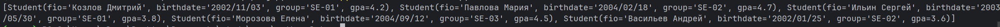
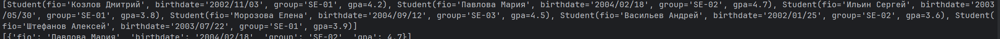
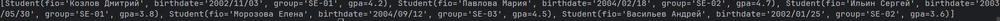
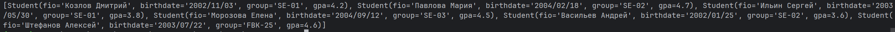
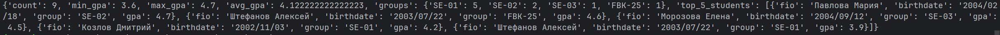

## Лабораторная работа 9
#### Примеры запуска методов класса 
##### Начальный csv
```csv 
fio,birthdate,group,gpa
Козлов Дмитрий,2002/11/03,SE-01,4.2
Павлова Мария,2004/02/18,SE-02,4.7
Ильин Сергей,2003/05/30,SE-01,3.8
Морозова Елена,2004/09/12,SE-03,4.5
Васильев Андрей,2002/01/25,SE-02,3.6
```
Формируем группу
```python
group = Group('./data/lab09/students.csv')
```
1. list()
```python
print(group.list())
```

2. add()
```python
students = Student('Штефанов Алексей','2003/07/22','SE-01',3.9)
print(group.add(students))
print(group.list())
```

3. find()
```python
print(group.find("Павлова Мария"))
```

4. remove()
```python
group.remove('Штефанов Алексей')
print(group.list())
```

5. update()
```python
group.update('Штефанов Алексей',gpa = 4.6,group = 'FBK-25')
print(group.list())
```

6. stats()
```python
print(group.stats())
```

